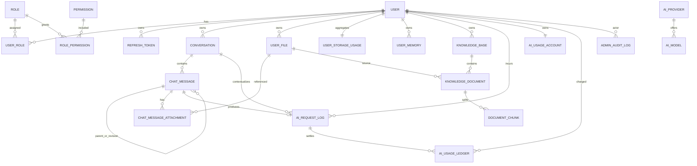

# AI Chat SaaS 数据库设计

> 状态：阶段 1 核心表 V1、阶段 2 认证表 V2、阶段 3 消息字段 V3、阶段 5 request log V4、阶段 7 文件 V5、阶段 8 短记忆 V6、阶段 9 长期记忆 V7、阶段 10 RAG V8、阶段 11 审计 V9、阶段 12 AI 用量 V10 已落地  
> 目标关系库：MySQL 8.x；自动化测试使用 H2 MySQL compatibility mode，生产前仍需在实际 MySQL 小版本验证

阶段 4 仅建设无状态 Python AI Service，没有新增表。阶段 10 新增 V8 Knowledge/RAG 业务事实；Python 仍不连接业务 MySQL。阶段 11 新增 V9 管理员审计，阶段 12 新增 V10 AI 用量账户与不可变 ledger；价格历史增强仍延后。

## 0. 阶段 1 实施结果

本阶段采用 Spring Data JPA + Flyway 的单一持久化体系：Flyway 是 schema 唯一变更入口，Hibernate 使用 `ddl-auto=validate` 校验实体映射，不自动建表或改表。

首批物理表共 7 张：

| 领域名 | 物理表 | 本阶段用途 |
| --- | --- | --- |
| user | `app_user` | 用户主体及状态基础；尚未实现注册、登录、密码策略 |
| role | `app_role` | 角色字典基础 |
| user_role | `app_user_role` | 用户与角色关联 |
| conversation | `conversation` | 会话归属与消息序号聚合根 |
| chat_message | `chat_message` | 消息事实、生成状态和 checkpoint 基础 |
| ai_provider | `ai_provider` | Provider 非敏感配置与 Secret 引用 |
| ai_model | `ai_model` | 模型能力、状态和价格快照来源基础 |

阶段 2 新增 `V2__create_auth_schema.sql`：为 `app_user` 增加 `auth_version`，创建 `refresh_token`，并初始化内置 `USER`、`ADMIN`、`SUPER_ADMIN` 角色。`permission`、`role_permission` 延后到出现细粒度管理员动作时创建；当前 RBAC 使用固定角色和服务端 endpoint 规则。`user_file`、Memory、RAG、usage、audit 仍按相应业务阶段创建。

阶段 3 新增 `V3__extend_chat_message_model.sql`：在不重建 V1 表的前提下为 `chat_message` 增加 `total_tokens BIGINT NULL` 和 `error_message VARCHAR(1000) NULL`，并约束 `total_tokens >= 0`。现有 `content_text/content_format` 分别对应外部契约的 `content/contentType`。

已落实的跨表约束包括：

- 核心实体统一 `BIGINT` 内部主键、毫秒级 `created_at` / `updated_at`、乐观锁 `version`；外部资源使用 `CHAR(26)` ULID `public_id`。
- `app_user`、`conversation`、`chat_message` 使用 `status + deleted_at` 软删除，并以 CHECK 保证二者一致；Repository 的资源查询显式带 `deleted_at IS NULL` 和 owner 条件。
- `chat_message(conversation_id,user_id)` 复合外键约束消息必须与会话属于同一用户；父消息/被替代消息也被限制在同一会话和用户范围。
- 已为 `user_id`、`conversation_id`、`status`、`created_at`、`updated_at` 的主要访问路径建立复合或排序索引。索引有效性仍需在真实查询和 MySQL `EXPLAIN` 中持续验证。

## 1. 设计原则

- MySQL 是用户、权限、消息、文件元数据、配置、usage 和审计的事实源。
- 主键建议用 `BIGINT UNSIGNED` 内部 ID；用户拥有的资源另设不可枚举的 `public_id CHAR(26)` ULID 唯一键。Role/Permission 可用稳定 `code` 暴露，API 永不暴露内部 ID。
- 所有外键列与主键类型完全一致。金额使用 `DECIMAL`，时间使用 UTC `DATETIME(3)`，JSON 只存结构可变且无需强关系查询的数据。
- 核心表统一 `created_at`、`updated_at`；需要软删除的业务资源使用 `deleted_at`。审计/请求日志采用保留策略，不伪装成软删除业务表。
- ownership 必须进入查询条件。不可因使用 ULID 而省略 `user_id` 条件。凡子表冗余 `user_id`，应在父表建立 `(id,user_id)` 唯一键并使用复合外键，防止跨用户脏关联。
- 每一批表只随对应业务阶段通过 Flyway migration 创建；本文不是“一次建全库”的指令。
- Redis、VectorStore、Object Storage 是可重建/外部存储，关系库保存其稳定引用和业务状态。

## 2. 关系概览

用户给出的未来表清单没有列出 `permission`、`role_permission` 和 `conversation_summary`；本文补充它们，因为细粒度 RBAC 和短期记忆需要这些关系，但仍只在对应阶段创建。

## 3. 通用枚举与删除语义

枚举存可读字符串并由 Java/Python 集中校验，不使用含义不清的单 Boolean。

| 对象 | 建议状态 |
| --- | --- |
| User | `NORMAL`, `BANNED`, `DISABLED`, `DELETED` |
| Conversation | `ACTIVE`, `ARCHIVED`, `DELETED` |
| Chat message | `PENDING`, `STREAMING`, `COMPLETED`, `STOPPED`, `FAILED`, `DELETED` |
| User file | `UPLOADING`, `AVAILABLE`, `QUARANTINED`, `FAILED`, `DELETED` |
| Knowledge document | `PENDING`, `PARSING`, `CHUNKING`, `EMBEDDING`, `READY`, `FAILED`, `DELETED` |
| Memory | `ENABLED`, `DISABLED`, `DELETED` |
| Provider/Model | `ENABLED`, `DISABLED`（健康状态另列） |
| AI request | `STARTED`, `STREAMING`, `SUCCEEDED`, `STOPPED`, `FAILED`, `TIMED_OUT` |
| Refresh token | `ACTIVE`, `ROTATED`, `REVOKED`, `EXPIRED`, `REUSED` |

- **禁用**：运营/管理员主动关闭能力，可恢复。
- **封禁**：因风控禁止用户登录/调用，保留数据和原因。
- **注销/删除**：进入不可用和清理流程，设置 `deleted_at`，敏感信息按保留政策匿名化。
- 业务查询默认排除 `DELETED`，唯一约束是否允许“删除后重用”必须逐字段决定，不能依赖软删除后自然释放唯一键。
- 同时使用状态和 `deleted_at` 的表遵循：进入 `DELETED` 必须原子写入 `deleted_at`，非 `DELETED` 时必须为 NULL；用数据库 CHECK（版本支持时）和集成测试共同保证。FK 默认 `RESTRICT`，只对纯关联表采用明确的 `CASCADE`，不级联删除审计/usage/message 事实。
- 物理用户表建议命名 `app_user`，避免 `user` 关键字/系统对象歧义；领域和本文仍简称 `user`。

## 4. 身份与 RBAC

### 4.1 `user`

核心字段：`id`, `public_id`, `email_normalized`, `username`, `password_hash`, `display_name`, `avatar_file_id`, `status`, `ban_reason`, `banned_until`, `password_changed_at`, `last_login_at`, `created_at`, `updated_at`, `deleted_at`, `version`。

索引/约束：

- `UNIQUE(public_id)`。
- `UNIQUE(email_normalized)`；邮箱大小写和 Unicode 归一化规则在应用层固定。
- `UNIQUE(username)` 是否需要由产品确认；若只是展示名则不要加唯一。
- `INDEX(status, created_at, id)` 支持管理员列表。
- `avatar_file_id` 可为空并引用 `user_file`；为避免建表循环，可在后续 migration 添加外键。

密码只存强哈希（Argon2id 或兼容的自适应算法），绝不存可逆密码。

### 4.2 `role`, `user_role`, `permission`, `role_permission`

- `role`：`id`, `code`, `name`, `description`, `built_in`, timestamps；`UNIQUE(code)`。
- `user_role`：`user_id`, `role_id`, `granted_by`, `created_at`；复合主键或 `UNIQUE(user_id, role_id)`，并建 `INDEX(role_id, user_id)`。
- `permission`：`id`, `code`, `description`；`UNIQUE(code)`，例如 `admin.user.read`、`admin.chat.read_sensitive`。
- `role_permission`：`role_id`, `permission_id`；`UNIQUE(role_id, permission_id)`。

V2 已种入 `USER`、`ADMIN`、`SUPER_ADMIN`，当前层级为 `SUPER_ADMIN > ADMIN > USER`。`permission` 与 `role_permission` 尚未创建，因为当前只有管理员入口边界，没有细粒度管理员业务动作；出现首个敏感管理员动作时必须与 audit 一起补充。资源 ownership 仍由 Service/Repository 查询实现，不能用 RBAC 代替。

### 4.3 `refresh_token`

阶段 2 已采用数据库管理 refresh session，以支持 rotation、复用检测、当前 session 退出和全部退出。

已实现字段：`id`, `public_id`, `user_id`, `family_id`, `token_hash`, `status`, `issued_at`, `expires_at`, `rotated_at`, `revoked_at`, `replaced_by_id`, `last_used_at`, timestamps, `version`。IP/User-Agent 哈希只有在明确设备会话产品需求和保留策略后才增加。

索引/约束：

- `UNIQUE(token_hash)`；只保存带 server pepper 的哈希，不保存原 Token。
- `INDEX(user_id, status, expires_at)`。
- `INDEX(family_id, status)`，检测旧 token 重用后撤销整族。
- `replaced_by_id` 自引用可为空。

## 5. Conversation 与 Message

### 5.1 `conversation`

字段：`id`, `public_id`, `user_id`, `title`, `status`, `default_model_id`, `last_message_at`, `message_count`, `created_at`, `updated_at`, `deleted_at`, `version`。

索引/约束：

- `UNIQUE(public_id)`。
- `INDEX(user_id, status, last_message_at DESC, id DESC)`：自己的会话列表。
- `INDEX(user_id, updated_at DESC, id DESC)`：用户范围搜索/同步。
- 标题搜索先用 MySQL FULLTEXT 的适用性验证；数据规模未证明前不引入 Elasticsearch。

`message_count` 是可重建计数器，需要事务或异步校正；不能作为唯一事实。

### 5.2 `chat_message`

字段：

- 标识/归属：`id`, `public_id`, `conversation_id`, `user_id`（冗余 owner，用于高频 ownership scope）。
- 结构：`role`, `sequence_no`, `parent_message_id`, `supersedes_message_id`, `variant_no`。
- 内容：`content_text`, `content_format`, `status`, `finish_reason`, `error_code`, `error_message`。
- 生成：`model_id`, `prompt_tokens`, `completion_tokens`, `total_tokens`, `checkpoint_seq`, `checkpoint_at`, `started_at`, `completed_at`。
- 幂等/并发：`client_request_id`, `content_hash`, `version`。
- 生命周期：`created_at`, `updated_at`, `deleted_at`。

索引/约束：

- `UNIQUE(public_id)`。
- `UNIQUE(conversation_id, sequence_no, variant_no)`。
- `UNIQUE(user_id, client_request_id)`（仅客户端创建的消息有值；MySQL 允许多个 NULL）。
- `INDEX(conversation_id, sequence_no, id)`。
- `INDEX(user_id, status, created_at, id)`。
- `INDEX(parent_message_id, variant_no)` 支持重新生成的 Assistant variants。
- 必须使用复合外键 `(conversation_id, user_id) → conversation(id, user_id)`，父表增加 `UNIQUE(id,user_id)`；attachment/document/chunk 等冗余 owner 关系采用同一模式。

编辑重发不覆盖原消息：创建相同 `sequence_no` 的新 USER variant，设置 `supersedes_message_id` 并保留原 parent；其新 Assistant 以修订 USER 为 parent，并替代该回答 sequence 的当前 Assistant。重新生成则复用目标 Assistant 的 USER parent，创建相同 `sequence_no` 的新 ASSISTANT variant。阶段 6 已按上述模型实现，UI 通过 parent 链选择最新活动叶分支，历史事实不覆盖、不删除。

阶段 6 没有新增表或索引：V1 已有的 `UNIQUE(conversation_id, sequence_no, variant_no)`、`INDEX(parent_message_id, variant_no)`、同会话/同 owner 的 parent 与 supersedes 复合外键能够覆盖当前写入和读取路径；本阶段的 Spring ownership 集成测试验证其他用户不能执行两种变体操作。

`STREAMING` Assistant 在调用 Python 前创建。增量内容按受控批次把当前 `content_text`、最后已接受的 `checkpoint_seq`、`checkpoint_at` 和 `content_hash` 原子更新；恢复任务以这些字段作为本地证据。结束时写 `COMPLETED/STOPPED/FAILED` 和最终 token；不能等流结束才插入记录。

`sequence_no` 由 Spring 在创建消息的短事务中锁定 conversation 行并递增 `message_count/next_sequence_no` 分配；唯一键兜底，死锁或唯一冲突执行有界重试。不得用“先查 MAX 再无锁 + 1”。

### 5.3 `chat_message_attachment`

阶段 7 V5 已实现。字段：`id`, `message_id`, `user_file_id`, `user_id`, `attachment_type`, `sort_order`, `created_at`。

约束：`UNIQUE(message_id, user_file_id)`、`INDEX(message_id, sort_order, id)`、`INDEX(user_file_id, message_id)`、`INDEX(user_id, created_at, id)`。V5 先为 `chat_message(id,user_id)` 建唯一键，再用两条复合外键保证 message/file 的 `user_id` 一致；Service 仍要求文件属于当前用户且为 `AVAILABLE`。附件只是消息引用，不自动成为知识库文档。

### 5.4 `conversation_summary`（阶段 8 已落地）

V6 实际字段：`id`, `public_id`, `conversation_id`, `user_id`, `summary_version`, `summary_text`, `covered_through_message_id`, `covered_through_sequence_no`, `source_message_count`, `estimated_tokens`, `status`, `created_at`, `updated_at`, `version`。

- `UNIQUE(public_id)`、`UNIQUE(conversation_id, summary_version)`、`UNIQUE(conversation_id, covered_through_message_id)`。
- `INDEX(conversation_id, status, summary_version, id)`、`INDEX(user_id, updated_at, id)`、`INDEX(covered_through_message_id, status, id)`。
- `(conversation_id,user_id)` 和 `(covered_through_message_id,conversation_id,user_id)` 复合外键保证摘要、锚点消息与 owner 一致。
- 状态为 `ACTIVE/INVALID`；计数、版本和 estimated token 均必须为正。

每个摘要只覆盖其 `covered_through_message_id` 所在祖先分支。ContextBuilder 沿当前叶节点做有界祖先遍历，仅在实际命中锚点时使用摘要；编辑重发到锚点之前不会误用另一分支摘要。旧版本保持 ACTIVE 以服务旧分支，不做“整会话只保留一个摘要”的破坏性覆盖。Summary 是可重建派生数据，但版本/锚点是并发和分支正确性的事实，不能写入 `user_memory`。

## 6. File 与 Cloud Disk

### 6.1 `user_file`

阶段 7 V5 已实现首版。实际字段：`id`, `public_id`, `user_id`, `original_name`, `storage_name`, `object_key`, `declared_mime`, `detected_mime`, `extension`, `size_bytes`, `sha256`, `storage_provider`, `status`, `metadata_json`, `created_at`, `updated_at`, `deleted_at`, `version`。`metadata_json` 当前只保存受控的 `category/previewable`，为未来多模态元数据保留扩展点。

索引/约束：

- `UNIQUE(public_id)`、`UNIQUE(storage_provider, object_key)`、`UNIQUE(id,user_id)`。
- `INDEX(user_id, status, created_at, id)`、`INDEX(user_id, updated_at, id)`、`INDEX(status, updated_at, id)`。
- `INDEX(user_id, sha256, size_bytes)` 用于用户范围去重候选，不默认跨用户复用对象。

状态为 `UPLOADING/AVAILABLE/DELETING/FAILED/DELETED`，CHECK 保证只有 `DELETED` 带 `deleted_at` 且 `size_bytes > 0`。`object_key` 由服务端生成，不含原始路径；下载/删除按 `public_id + user_id + AVAILABLE` 查。当前删除按 `AVAILABLE → DELETING → DELETED` 执行，本地对象删除失败时恢复 `AVAILABLE`；有聊天引用时拒绝删除。异步重试/恢复任务尚未实现。

### 6.2 `user_storage_usage`

阶段 7 V5 已实现：`user_id`（PK/FK）, `used_bytes`, `reserved_bytes`, `file_count`, `quota_bytes`, `version`, `updated_at`。migration 为现有用户回填行，注册事务为新用户创建默认额度行。

上传初始化在悲观锁定 usage 行后增加 `reserved_bytes`，对象写入完成再于短事务转为 `used_bytes` 并增加 `file_count`；失败释放 reservation。CHECK 保证所有计数非负且 `used_bytes + reserved_bytes <= quota_bytes`。该表是配额快速视图，周期对账和过期 reservation 恢复仍待生产加固阶段实现。

## 7. Memory

### 7.1 `user_memory`

阶段 9 V7 已实现：`id`, `public_id`, `user_id`, `content_text`, `summary`, `memory_type`, `importance`, `source_conversation_id`, `source_message_id`, `origin`, `content_hash`, `enabled`, `created_at`, `updated_at`, `deleted_at`, `version`。

枚举/约束：

- `memory_type=PREFERENCE|PROJECT|GOAL|EXPLICIT`，`origin=MANUAL|AUTO`，`importance` 为 1..100。
- `UNIQUE(public_id)`；source message 与 conversation 必须同时为空或同时存在。
- source conversation/message 使用含 `user_id` 的复合外键，数据库层阻止跨用户来源关联。
- 软删除必须同时令 `enabled=false`；禁用和删除记忆均不参与检索。

索引：

- `INDEX(user_id, enabled, deleted_at, importance, updated_at, id)`：检索候选与启用过滤。
- `INDEX(user_id, memory_type, updated_at, id)`：用户类型筛选与管理列表。
- `INDEX(user_id, content_hash, deleted_at, id)`：自动提取去重。
- source conversation/message 索引支持来源追踪。

当前检索由 Spring 先按 owner + enabled + not-deleted 查询固定上限候选，再按 query relevance + importance 排序并执行 Top-K/Token Budget；不会 SELECT 全部 Memory。V7 没有提前加入 embedding/vector 字段，RAG/向量选型仍独立延后；未来语义索引必须携带 `user_id` filter，并保持 MySQL 为 Memory 事实源。

## 8. Knowledge Base 与 RAG

### 8.1 `knowledge_base`

V8 实际字段：`id`, `public_id`, `user_id`, `name`, `description`, `status`, timestamps, `deleted_at`, `version`。

约束：`UNIQUE(public_id)`、`UNIQUE(id,user_id)` owner FK target、ACTIVE/DELETED 与 `deleted_at` 一致性 CHECK；索引 `(user_id,status,updated_at,id)`。

### 8.2 `knowledge_document`

V8 实际字段：`id`, `public_id`, `knowledge_base_id`, `user_id`, `user_file_id`, `status`, `parser_type`, `chunk_count`, `processing_version`, `embedding_provider`, `embedding_model`, `error_code`, `error_message`, `started_at`, `completed_at`, timestamps, `deleted_at`, `version`。

约束/索引：

- `UNIQUE(public_id)`。
- `UNIQUE(knowledge_base_id, user_file_id)`；失败采用同一行 `processing_version + 1` retry，不制造多个活动引用。
- `(knowledge_base_id,user_id)` 与 `(user_file_id,user_id)` 复合外键从数据库层阻止跨 owner 关联。
- `INDEX(knowledge_base_id, status, created_at, id)`。
- `INDEX(user_id, status, updated_at, id)`。

知识库文档引用 `user_file`，但二者生命周期独立：从 KB 移除不必删除云盘文件；删除源文件前必须检查引用并执行明确策略。

### 8.3 `document_chunk`

V8 实际字段：`id`, `public_id`, `knowledge_document_id`, `knowledge_base_id`, `user_id`, `chunk_index`, `content_text`, `token_count`, `page_number`, `source_metadata_json`, `content_hash`, `processing_version`, timestamps, `version`。

约束/索引：

- `UNIQUE(knowledge_document_id,processing_version,chunk_index)`。
- 三列复合外键 `(knowledge_document_id,knowledge_base_id,user_id)` 防止 chunk 跨文档/KB/owner 写入。
- 索引 `(knowledge_base_id,user_id,id)` 与 `(knowledge_document_id,processing_version,chunk_index)`。

VectorStore metadata 至少包含 `userId/knowledgeBaseId/documentId/chunkIndex`，检索必须 server-side filter；Spring 再用 MySQL READY 状态和 owner 复核，不能检索后只靠 Vue 隐藏越权结果。

### 8.4 `conversation_knowledge_base`

字段：`id`, `conversation_id`, `knowledge_base_id`, `user_id`, timestamps, `version`。`UNIQUE(conversation_id,knowledge_base_id)`；Conversation 与 KB 两侧都以 `(id,user_id)` 复合外键约束同 owner。索引 `(user_id,conversation_id)` 支持每轮 ContextBuilder 的有界绑定读取，`(knowledge_base_id,conversation_id)` 支持删除/影响面查询。

文档状态严格为 `UPLOADED → PARSING → PARSED → EMBEDDING → READY`，任一处理失败进入 `FAILED`；只有 FAILED 可 retry。数据库是文档状态事实源，SQLite/未来外部 VectorStore 是可重建派生索引。

## 9. Provider、Model 与 AI Usage

### 9.1 `ai_provider`

字段：`id`, `public_id`, `code`, `display_name`, `provider_type`, `base_url`, `credential_ref`, `non_secret_config_json`, `status`, `health_status`, `last_health_checked_at`, timestamps, `version`。

约束：`UNIQUE(code)`、`UNIQUE(public_id)`、`INDEX(status, provider_type)`。API Key 不放 `non_secret_config_json`；优先存 Secret Manager 引用。若必须存密文，密钥加密和轮换要单独设计。

### 9.2 `ai_model`

字段：`id`, `public_id`, `provider_id`, `code`, `external_model_id`, `display_name`, `model_type`, `capabilities_json`, `context_window`, `max_output_tokens`, `input_price`, `output_price`, `currency`, `price_effective_from`, `parameter_policy_json`, `status`, `sort_order`, `is_default`, timestamps, `version`。

约束：`UNIQUE(provider_id, external_model_id)`、`UNIQUE(code)`、`INDEX(status, model_type, sort_order)`、`INDEX(is_default)`。当前价带 `price_effective_from`，每次请求复制价格快照；若需要查询完整调价历史，后续增加带 `effective_from/effective_to` 的 `ai_model_price` 版本表，不覆盖历史计费依据。

阶段 11E 新增 `V11__extend_ai_catalog.sql`：`ai_model.is_default BOOLEAN NOT NULL DEFAULT FALSE` 与 `idx_ai_model_default`。`is_default` 在同一 `model_type` 内最多一个为真（由 `AdminAiService.modelDefault` 在事务内先清除同类型旧默认再置位；停用模型同时清除该标记），数据库不额外加唯一约束以避免跨行更新顺序问题。`capabilities_json` 与 `parameter_policy_json` 的读写统一由 `AiCatalogJsonCodec` 承担：写入结构为 `{streaming,vision,reasoning,embedding}` 与 `{defaultTemperature,defaultTopP,defaultMaxOutputTokens}`，读取兼容历史上的数组式与嵌套式形状；`ai_provider.non_secret_config_json` 存 `{timeoutSeconds,connectTimeoutSeconds}`。**`credential_ref` 始终只存引用**（`env:NAME`/`vault:…`），明文密钥既不落库也不进入审计（ADR-061）。

### 9.3 `ai_request_log`

阶段 5 的 V4 已创建最小请求事实表。实际字段：`id`, `request_id`, `user_id`, `conversation_id`, `assistant_message_id`, `provider_id`, `model_id`, `provider_code`, `model_code`, `external_model_id`, `status`, `latency_ms`, `prompt_tokens`, `completion_tokens`, `total_tokens`, `error_code`, `started_at`, `completed_at`, `created_at`, `updated_at`, `version`。

索引/约束：

- `PRIMARY KEY(id)`、`UNIQUE(request_id)`。
- `UNIQUE(assistant_message_id)`；每条 Assistant placeholder 只对应一次生成记录。
- `INDEX(user_id, created_at DESC, id DESC)`。
- `INDEX(conversation_id, created_at, id)`。
- `INDEX(status, created_at, id)`、`INDEX(provider_id, model_id, created_at, id)`。
- `INDEX(updated_at, id)` 支持恢复/运维扫描。
- 外键分别约束用户、会话、Assistant message、Provider 与 Model；状态 CHECK 为 `PENDING/STREAMING/COMPLETED/STOPPED/FAILED`，token/latency 必须非负。

默认不保存完整 Prompt/Response。若未来因合规需抽样保存，必须独立受控表、加密、短保留期、权限和审计，不能直接加两个 TEXT 字段后默认全量记录。

生成关系由 `ai_request_log.assistant_message_id` 单向引用消息；USER message 可由 Assistant 的 `parent_message_id` 定位。API 使用唯一的 `ai_request_log.request_id`。Provider/model code 与 external model id 是请求时快照，避免配置改名破坏历史诊断。

生成幂等暂复用 `chat_message` 已存在的 `UNIQUE(user_id, client_request_id)`；重复 key 返回冲突而不是重放。`trace_id`、价格/cost、provider request id、first-token latency 与通用幂等响应快照在实际需求阶段通过新 migration 添加，不把目标字段误写成当前事实。

### 9.4 `ai_usage_account`, `ai_usage_ledger`（阶段 12 第一批已落地）

- `ai_usage_account`：`user_id`（PK/FK）, `quota_tokens`, `used_tokens`, `reserved_tokens`, `quota_cost`, `used_cost`, `reserved_cost`, `currency`, `period_start`, `period_end`, `updated_at`, `version`。首版平台结算币种统一，账户周期内不得改变币种。
- `ai_usage_ledger`：`id`, `public_id`, `user_id`, `ai_request_id`, `operation_key`, `entry_type`, `token_delta`, `cost_delta`, `currency`, `created_at`, `updated_at`, `version`。

`entry_type` 至少为 `RESERVE`, `SETTLE`, `RELEASE`, `ADJUST`；`operation_key` 使用 `RESERVE/SETTLE/RELEASE` 三个稳定值。`UNIQUE(ai_request_id, operation_key)` 保证每个业务动作幂等，允许不同 `operation_key` 的多次人工 adjustment；`INDEX(user_id, created_at, id)` 支持对账，`INDEX(ai_request_id)` 支持按请求追踪。

`token_delta/cost_delta` 统一表示「已承诺用量（`used + reserved`）的增量」，`sum(delta) == used + reserved` 恒成立：`RESERVE` 为正，`SETTLE` 为「真实用量 − 预留」（可负，表示退回差额），`RELEASE` 为预留的相反数。语义与生命周期见 ADR-051。

Ledger 在代码层只提供 `save` 与查询方法，不提供 update/delete；后续变化只能追加反向/调整条目。Account 是并发快速余额，Ledger 是不可变对账事实；二者在本地事务中原子更新，悬挂 reservation 由启动恢复扫描 interrupted request 追加 RELEASE 释放。首版不引入 `expires_at`：`AI_REQUEST_LOG` 状态是悬挂预留的事实依据，周期对账阶段再评估是否需要基于时间的清扫索引。

CHECK 约束保证所有计数非负、`used + reserved <= quota`（token 与 cost 各一条）且 `period_end > period_start`；周期到期后由访问路径惰性滚动重置，历史事实只由 ledger 保留。

`ADJUST` 行的 `ai_request_id` 为 NULL，因此不参与 `UNIQUE(ai_request_id, operation_key)`，幂等由调用方保证唯一的 `operation_key`（`ADJUST:<ULID>`）承担；`AiUsageLedgerRepository` 不提供 update/delete。周期对账以 `ai_request_log` 终态为事实清扫悬挂 `RESERVE`，并比对账户 `used + reserved` 与 `period_start` 之后的 ledger 求和，漂移只告警不自动改写（ADR-053）。

### 9.5 `idempotency_record`（跨业务通用）

字段：`id`, `user_id`, `operation`, `key_hash`, `resource_public_id`, `request_hash`, `status`, `response_code`, `response_snapshot_json`, `expires_at`, timestamps。

`UNIQUE(user_id, operation, key_hash)`；相同 key 但不同 `request_hash` 返回 `40009 IDEMPOTENCY_CONFLICT`。响应快照只保存安全、有限大小的数据，不保存 SSE token 流或敏感正文。聊天生成以 `ai_request_log` 为事实记录，其他上传初始化等操作按需使用本表。

## 10. Admin Audit

### 10.1 `admin_audit_log`

字段：`id`, `public_id`, `actor_user_id`, `action`, `target_type`, `target_public_id`, `target_owner_user_id`, `reason`, `result`, `request_id`, `trace_id`, `ip_hash`, `user_agent_hash`, `metadata_json`, `created_at`。

索引：`INDEX(actor_user_id, created_at DESC, id DESC)`、`INDEX(target_type, target_public_id, created_at)`、`INDEX(target_owner_user_id, created_at)`、`INDEX(action, created_at)`、`INDEX(trace_id)`。

此表追加写；代码层不提供 update/delete Repository，生产数据库应为审计写路径使用只授予 `INSERT/SELECT` 的独立权限，并用完整性校验/外部归档发现篡改。`metadata_json` 只放字段级差异和脱敏摘要，不放聊天全文、Token、Cookie 或密钥。查看用户聊天/消息/文件/Memory、封禁、重置密码、角色变更等必须记录。

## 11. 事务、一致性与并发

- 登录/refresh rotation、消息占位创建、配额 reservation、文件 quota、管理员动作 + audit 分别定义清晰事务边界。
- 外部 LLM/Object/Vector 调用绝不持有数据库长事务；采用状态机、幂等键和补偿/对账。
- 带 `version` 的聚合根采用乐观锁；状态更新使用 `WHERE id=? AND status=?` 防止重复终止。
- AI usage 先 reserve，结束按真实 usage settle；超时任务回收悬挂 reservation。
- 定时恢复任务扫描超时的 `STREAMING` message、`STARTED/STREAMING` request 和未决 reservation，按 Provider/本地 checkpoint 证据收敛到唯一终态。终态竞争使用 compare-and-set，停止不能覆盖已成功完成，迟到的 done 也不能覆盖已停止状态。
- 删除跨 Object/VectorStore 时先标记 `DELETED/PENDING_DELETE`，异步幂等清理；清理失败可重试且保留审计。

## 12. 分阶段 migration 计划

| 阶段 | 只创建当期需要的表 |
| --- | --- |
| 1（已完成） | `app_user`, `app_role`, `app_user_role`, `conversation`, `chat_message`, `ai_provider`, `ai_model` |
| 2（已完成） | `refresh_token`，`app_user.auth_version`，初始化 `USER/ADMIN/SUPER_ADMIN`；`permission/role_permission` 延后 |
| 3（已完成） | V3 扩展 `chat_message.total_tokens/error_message` |
| 4（无 DB 变更） | Python AI Service 基础 |
| 5（已完成） | V4 创建最小 `ai_request_log`；usage account/ledger 仍延后 |
| 7（已完成） | V5 创建 `user_file`, `user_storage_usage`, `chat_message_attachment`，增加同 owner 复合约束 |
| 10（已完成） | V8 `knowledge_base`, `knowledge_document`, `document_chunk`, `conversation_knowledge_base` |
| 8（已完成） | V6 `conversation_summary` |
| 9（已完成） | V7 `user_memory`；不创建 RAG/向量表 |
| 11（已完成） | V9 `admin_audit_log` |
| 12 第一批（已完成） | V10 `ai_usage_account`, `ai_usage_ledger`；价格历史增强仍延后 |
| 11E（已完成） | V11 扩展 `ai_model.is_default` + `idx_ai_model_default`，支撑平台默认模型 |
| 11F（已完成） | V12 仅增索引：`ai_request_log(created_at, id)` 与 `admin_audit_log(created_at, id)`，支撑日志时间区间筛选（不新增表） |

每个 migration 必须同时有 Repository 集成测试和关键索引查询验证。建议基线为 MySQL 8.4 LTS、`utf8mb4` 与明确排序规则（普通文本候选 `utf8mb4_0900_ai_ci`，ID/code/hash 使用 ASCII/binary collation）；实际 DDL 前必须以部署环境验证并锁定小版本、排序规则、ULID 生成、软删除唯一约束和数据保留政策。
